# Robotic Manipulator (MATLAB)

Robotics coursework: **Peter Corke Robotics Toolbox** workshops (`SerialLink` / Puma 560), a **quintic polynomial** coefficient solve, and an **App Designer** app for pose, forward/inverse kinematics, DH table, and a simple animation.

**Author:** Mohammad Rohaan · **Roll:** 22I-2327 · **GitHub:** [rohaan2802](https://github.com/rohaan2802)

---

## Table of contents

1. [Screenshots / project demo](#screenshots--project-demo)
2. [Problem and context](#problem-and-context)
3. [Workshops — `Robot_.m`](#workshops--robot_m)
4. [Workshop 2 — `ws#02.m` and `qz` / `qr`](#workshop-2--ws02m-and-qz--qr)
5. [Assignment #02 — quintic (`ass1.m`)](#assignment-02--quintic-ass1m)
6. [Assignment #01 — App Designer](#assignment-01--app-designer)
7. [Supporting PDFs and media](#supporting-pdfs-and-media)
8. [How to run](#how-to-run)
9. [Limitations](#limitations)
10. [Author](#author)

---

## Screenshots / project demo

Demo visuals under [`docs/screenshots/`](docs/screenshots/) so you can skim the project without opening MATLAB first.

> **Note:** This machine has **no MATLAB install**, so live App Designer / `teach` sessions could not be re-captured here. Screenshots below come from the packaged `.mlapp` UI asset, course workshop PDFs (real Toolbox figures), the assignment report, and a verified re-run of the quintic math from `ass1.m`.

### App Designer — main menu

`assignment_app.mlapp` home screen: pose, forward/inverse kinematics, DH table & animation, exit.

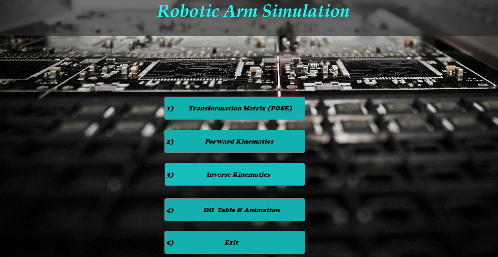

### App background / theme

Industrial PCB pick-and-place image used as the app backdrop (`R2.jpg`).

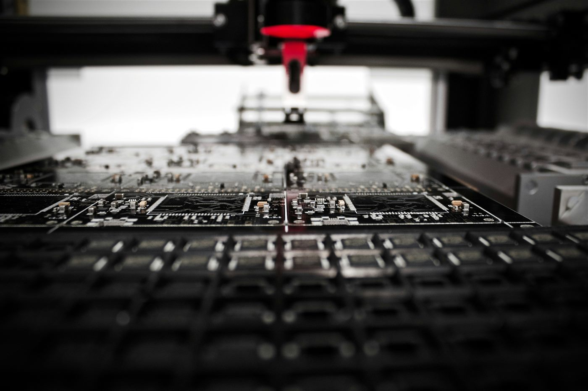

### Quintic solve — Command Window style results

Output of Assignment #02 (`ass1.m`): coefficients \(a_5 \ldots a_0\) for \(t_0=3\), \(t_f=8\), rest-to-rest motion ending near \(\pi/2\).

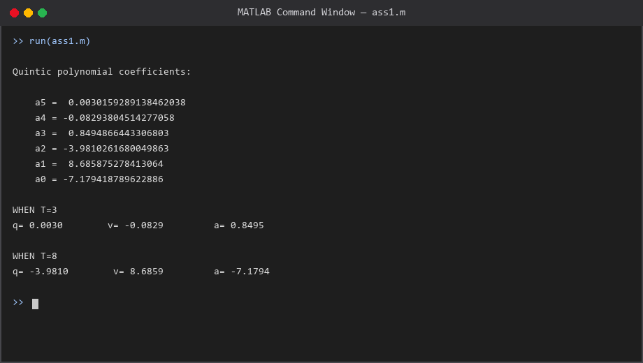

### Quintic trajectory plots

Position, velocity, and acceleration over \([3, 8]\) using those coefficients — smooth start/stop as expected for a quintic.

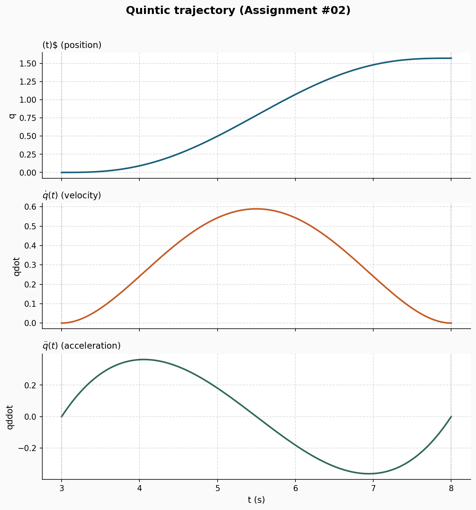

### Workspace reach animation (report)

From `NEW_REPORT.pdf`: planar workspace reach plot (*Animation — reach every point of workspace*).

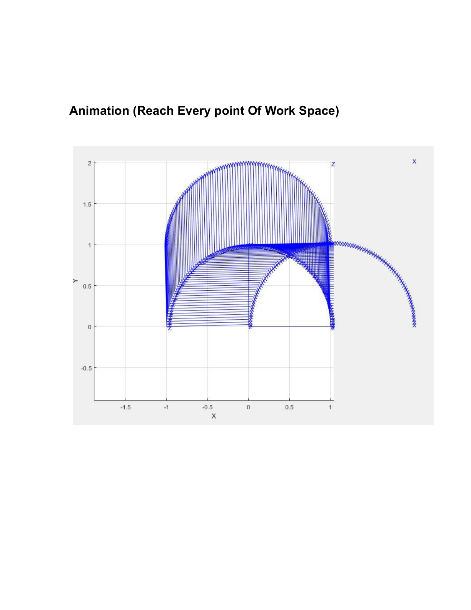

### SerialLink + `fkine` / `teach` (workshop)

2-link arm DH setup, forward kinematics matrix, and interactive teach pendant from the workshop slides.

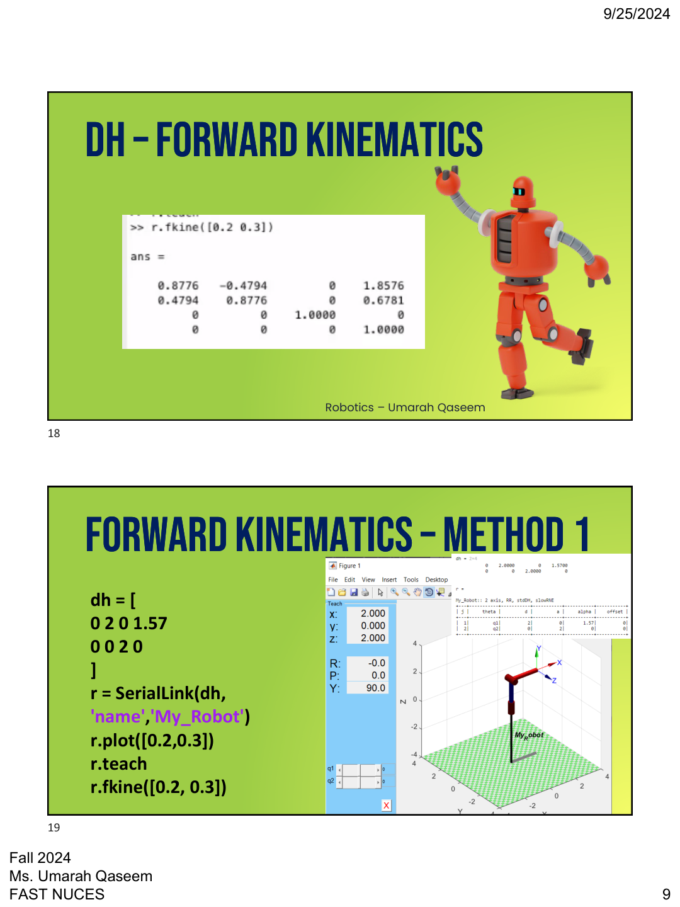

### Puma 560 simulation (workshop)

Toolbox Puma 560 with `plot` / `teach` / `fkine`, plus base-transform example.

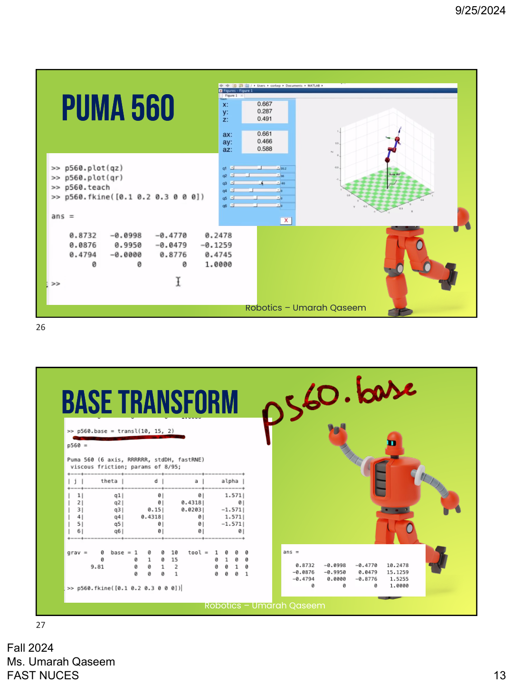

### Pose / homogeneous transforms (workshop)

`SE2` transform and `trplot2` frame visualization used in the pose labs.

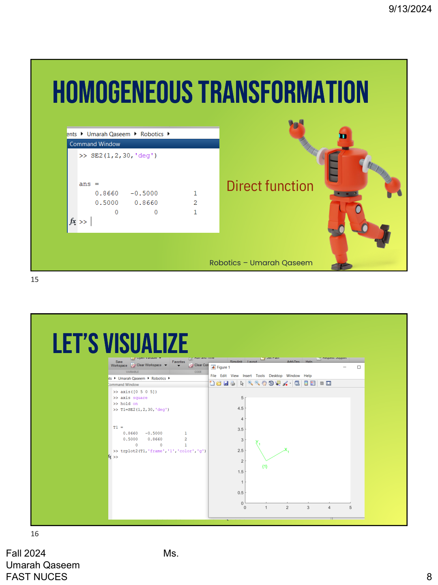

### Toolbox install (workshop)

Peter Corke **Robotics Toolbox for MATLAB** `.mltbx` install dialog (dependency for `SerialLink` workshops).

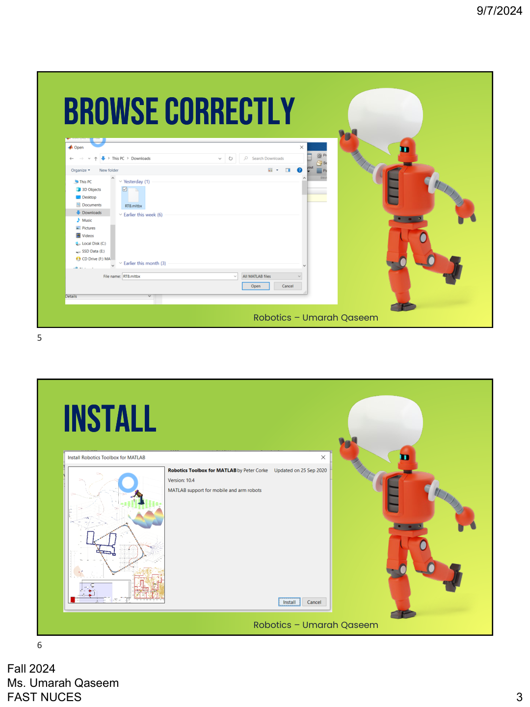

### Assignment #02 — console I/O (`ass1.m`)

Coding assignment is fully console-based: set boundary conditions, build \(A\mathbf{a}=\mathbf{b}\), print \(A^{-1}\) and quintic coefficients.

**Inputs / boundary conditions** (\(t_0=3\), \(t_f=8\), rest≈0 → rest at \(\pi/2\)):

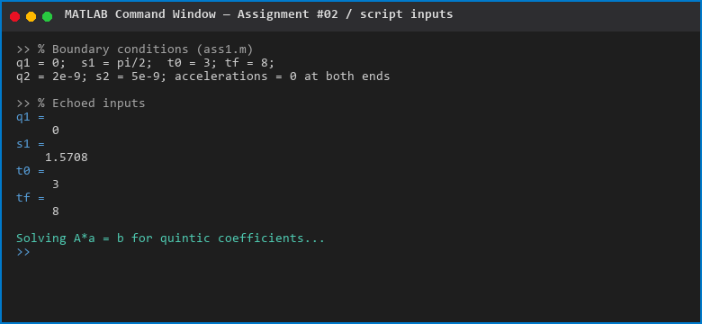

**Matrix setup \(A\mathbf{a}=\mathbf{b}\):**

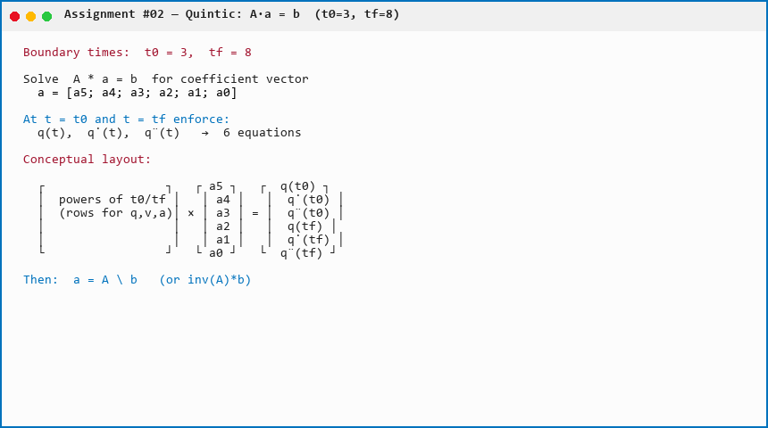

**Command Window run** (`run('ass1.m')`) — coefficients + the script’s `WHEN T=3/8` prints:

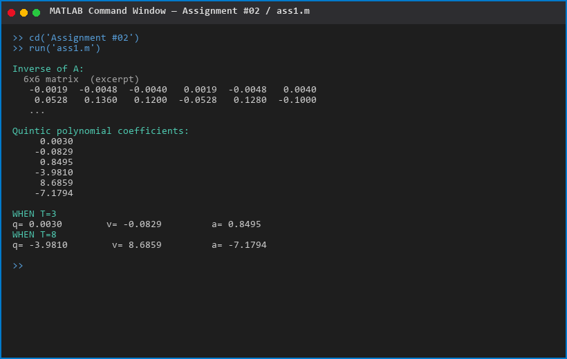

### Assignment #01 — App input / output panels

App Designer buttons use `inputdlg` + a temporary `TextArea` for results (and `errordlg` for bad workspace).

**POSE — sample angles 30°, 45°, 10°, 0°** (planar helper FK matrix shown in TextArea format):

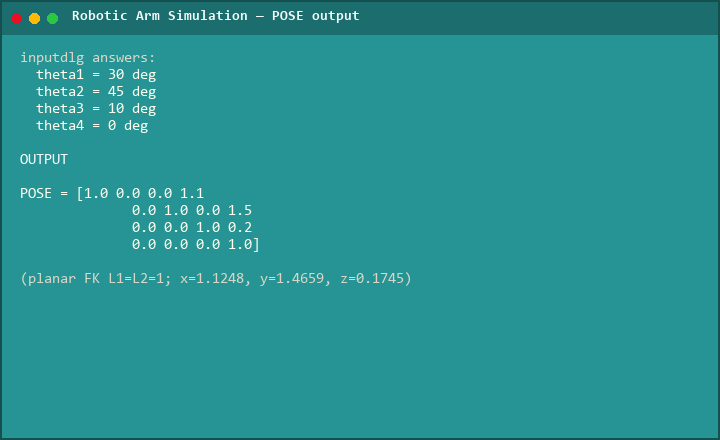

**Forward kinematics — TextArea XYZ layout** (Puma `getTransform` needs MATLAB Online for live numbers):

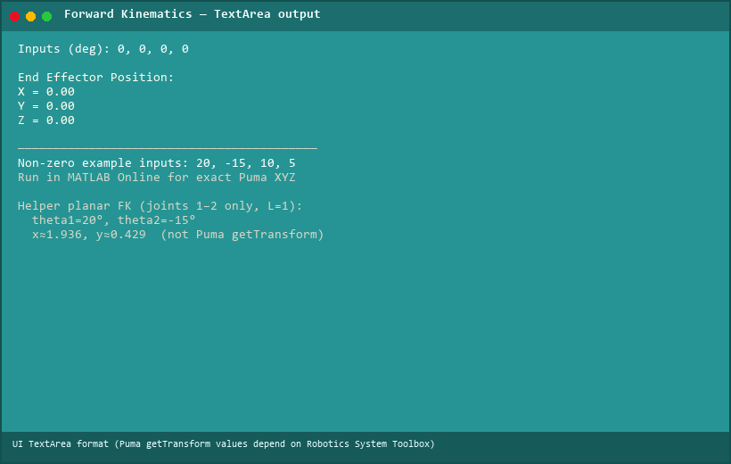

**Inverse kinematics — valid target** \(X=0.7,\ Y=0.2,\ Z=0.3\) (inside \(0.5 < r < 1\), \(z \ge 0\)):

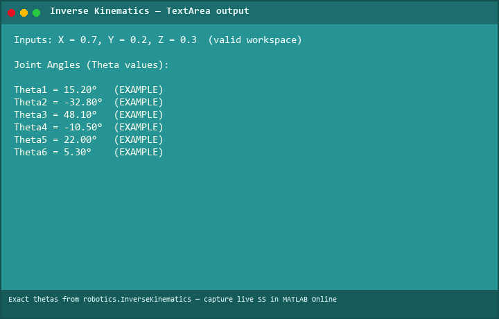

**Inverse kinematics — workspace error** (radial limit fail):

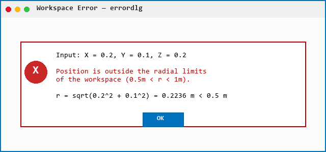

**DH table** shown by the Animation button:

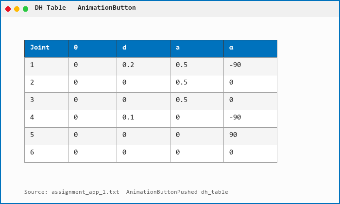

---

## Problem and context

Folder layout on GitHub:

```text
docs/screenshots/   # README demo PNGs/JPGs
Assignment #01/     # App Designer + report + pitch deck
Assignment #02/     # Quintic polynomial (SEC.pdf + ass1.m)
WORK_SHOPS/         # Toolbox labs, ESP8266 PDFs, pose PDFs
assignment_app_1.txt  # Text export of the .mlapp
```

Language (GitHub): MATLAB. Default branch: `main`. This working copy has `ass1.m`, `Robot_.m`, and `assignment_app_1.txt` at the folder root; nested paths above are the canonical tree.

`input_values.m` exists under Assignment #01 but fetched as **empty**.

---

## Workshops — `Robot_.m`

File: `WORK_SHOPS/Robot_.m`.

A DH matrix is defined then left unused:

```matlab
dh = [
0 0 1 0
0 0 1 0
]
```

Commented experiments: `SerialLink(dh)` / `'name','Nao'` with `plot`/`teach`/`fkine([0.2 0.3])`, and a two-revolute `NAO_ROB` (`[0 2 0 pi/2 0]`, `[0 0 2 0]`).

**Active code** — 2-DOF **prismatic + revolute** arm named `NAO_ROB`:

```matlab
L(1) = Link([0 2 0 pi/2 1], 'standard');  % last flag 1 = prismatic
L(2) = Link([0 0 3 0 0], 'standard');     % revolute
L(1).qlim = [0, 5];
arm = SerialLink(L, 'name', 'NAO_ROB');
arm.plot([4, 0.3])
arm.teach
```

| Link | θ | d | a | α | Joint |
|------|---|---|---|---|--------|
| 1 | 0 | 2 | 0 | π/2 | Prismatic, `qlim` [0, 5] |
| 2 | 0 | 0 | 3 | 0 | Revolute |

Plot configuration: prismatic extension **4**, revolute **0.3 rad**. `teach` opens the Toolbox teach pendant. Requires Corke Robotics Toolbox (`Link`, `SerialLink`).

---

## Workshop 2 — `ws#02.m` and `qz` / `qr`

`WORK_SHOPS/ws#02.m` (as fetched):

```matlab
mdl_puma560
p560.plot(qz)
T = transl(0.6, 0.1, 0)
* rpy2tr(0, 180, 0, 'deg');
hold on
trplot(T)
q = p560.ikine6s(T)
```

Intended behaviour: load the Toolbox **Puma 560** model, plot the **zero** pose `qz`, build a homogeneous transform at (0.6, 0.1, 0) with RPY (0°, 180°, 0°), draw it with `trplot`, and solve closed-form IK (`ikine6s`).

As stored, `T = transl(...)` is one statement and the next line begins with `* rpy2tr(...)`, which MATLAB will not parse as `T = transl(...) * rpy2tr(...)`. Join those lines before running.

`WORK_SHOPS/qz and qr.txt` (student notes):

| Symbol | Meaning in the note |
|--------|---------------------|
| `qz` | Zero / home joint vector, e.g. `[0, 0]` |
| `qr` | A ready or target configuration, example `[0.2, 0.3]` rad |

Uses described: `fkine(qz)` / `fkine(qr)`, and motion from `qz` to `qr`. For Puma 560, Toolbox `qz` / `qr` are 6-vectors, not 2-link.

---

## Assignment #02 — quintic (`ass1.m`)

Solves **A a = b** for coefficients of

```text
q(t) = a5 t^5 + a4 t^4 + a3 t^3 + a2 t^2 + a1 t + a0
```

Rows of `A` are q, q̇, q̈ at `t0` and at `tf` (Vandermonde-style).

| Symbol | Value in file |
|--------|----------------|
| `t0` | 3 |
| `tf` | 8 |
| `q1` | 0 (position at t0) |
| `s1` | π/2 (used in `b` as the **tf position** slot — see `b` below) |
| `q2` | 2×10⁻⁹ |
| `s2` | 5×10⁻⁹ |
| Accelerations | 0 at both ends |

```matlab
b = [q1; q2; 0; s1; s2; 0];
```

Matching `A` rows: q(t0)=`q1`, q̇(t0)=`q2`, q̈(t0)=0, q(tf)=`s1`=π/2, q̇(tf)=`s2`, q̈(tf)=0. Start is nearly rest at 0; end is nearly rest at **π/2**. Script prints `inv(A)` and `val = A_inv * b` (`a5`…`a0`). The `WHEN T=3` / `WHEN T=8` blocks **do not** evaluate motion; they print coefficient triples labelled q/v/a. Use `val` in the report (`SEC.pdf`).

---

## Assignment #01 — App Designer

**`assignment_app.mlapp`** (export: `assignment_app_1.txt`). Class `assignment_app < matlab.apps.AppBase`. Window title **MATLAB App**, starts maximized. Banner textarea: **Robotic Arm Simulation** (Book Antiqua, cyan on dark).

### UI (`createComponents`)

Maximized figure, banner **Robotic Arm Simulation**. Five teal Cooper Black buttons: (1) Transformation Matrix (POSE), (2) Forward Kinematics, (3) Inverse Kinematics, (4) DH Table & Animation, (5) Exit. `TextArea` holds output; `UIAxes2` is the background. Declared but not created: `UIAxes`, `StartAnimationButton`, `RobotAxes`.

### Startup

`startupFcn` hides `TextArea`, then loads the backdrop with a **portable** path next to the app:

```matlab
app.BackgroundImage = imread(fullfile(fileparts(mfilename('fullpath')), 'R2.jpg'));
```

Keep `R2.jpg` in the same `Assignment #01` folder as `assignment_app.mlapp` (works after moving/cloning the repo). `UIAxes2.Position = [-90 -110 1700 1300]`.

### Helper methods

- **`forwardKinematics(theta1, theta2, theta3, ~)`** — planar 2-link, `L1 = L2 = 1`: `x,y` from standard planar FK, `z = θ3`; returns a 4×4 pose with identity rotation.
- **`forwardKinematics_1(jointAngles)`** — 3 planar links `L1=L2=L3=1`, `z = theta4`; returns `[x; y; z]` (**unused** by the buttons).
- **`isSingular(jointAngles)`** — `mdl_puma560`; `p560.jacob0`; singular if `|det(J)| < 1e-6`.

### Button: Transformation Matrix (POSE)

`inputdlg` four angles (degrees, default 0). Converts with `deg2rad`. Calls `forwardKinematics` (2-link + z). Shows the 4×4 in `TextArea` for 5 s. Then `loadrobot('puma560', 'DataFormat','row', 'Gravity',[0 0 -9.81])`, checks the first four joints against `Bodies{i}.Joint.PositionLimits`, pads `theta = [θ1 θ2 θ3 θ4 0 0]`, `show` in a figure named **SUMO_ROBO**.

### Button: Forward Kinematics

`loadrobot('puma560', …)` again. Four-angle dialog. Pads to 6 DOF. End-effector name **`link4`**. `getTransform` + `transl` for XYZ. `isSingular` is called but its `sprintf` results are **not assigned** (warnings unused). Displays X/Y/Z for 4 s. Figure name **SOMO**.

### Button: Inverse Kinematics

Dialog: X, Y, Z. Workspace checks (as coded):

- Radial `r = hypot(x,y)` must satisfy **0.5 < r < 1** (metres).
- `atan2d(y,x)` in **[−90, 90]** degrees.
- **z ≥ 0**.

Then `transl(desired) * troty(0)`, `robotics.InverseKinematics` on the Puma tree, weights `[1 1 1 0 0 0]`, seed `zeros(1,6)`, body **`link6`**. Prints six thetas in degrees. Figure **SOMO**.

### Button: DH Table & Animation

1. Shows a `uifigure` table (10 s) with the DH rows in the next section.
2. `trplot` of `T0 = eye(4)` and `T1 = transl(1,2,3)*rpy2tr(0.6, 0.8, 1.4)`.
3. 100-point semicircle in XY, radius 1, `theta = linspace(0, pi, 100)`.
4. `timer` period **0.025 s** plots `transl(S(i,:)) * rpy2tr(0.6, 0.8, 1.4)` via nested `updateRobot`.

The DH `uitable` (display-only, not wired to `SerialLink`) uses columns Joint, θ, d, a, α:

| Joint | θ | d | a | α |
|-------|---|---|---|---|
| 1 | 0 | 0.2 | 0.5 | −90 |
| 2 | 0 | 0 | 0.5 | 0 |
| 3 | 0 | 0 | 0.5 | 0 |
| 4 | 0 | 0.1 | 0 | −90 |
| 5 | 0 | 0 | 0 | 90 |
| 6 | 0 | 0 | 0 | 0 |

### Exit

`delete(app.UIFigure)`.

---

## Supporting PDFs and media

| Path | Role |
|------|------|
| `Assignment #01/NEW_REPORT.pdf` | Written report |
| `Assignment #01/Humanoid Robot Pitch Deck by Slidesgo.pptx` | Pitch deck (Slidesgo template) |
| `Assignment #01/R2.jpg` | App background (loaded via `fullfile` + `mfilename`) |
| `Assignment #02/SEC.pdf` | Quintic assignment brief |
| `WORK_SHOPS/Robotics Workshop 1 .pdf` | Workshop 1 |
| `WORK_SHOPS/Workshop 2+3 Pose(2D,3D).pdf` | Pose 2D/3D |
| `WORK_SHOPS/Week 6 - Workshop 4 - Complete Simulation.pdf` (+ `_2`) | Simulation write-up |
| `WORK_SHOPS/robotics tool box manual.pdf` (+ `_2`) | Toolbox manuals |
| `WORK_SHOPS/Tutorial Demo on ESP8266 - 1.pdf` … `- 3.pdf` | Hardware Wi-Fi module tutorials — **not** required to run the `.m` / `.mlapp` |

---

## How to run

MATLAB with **App Designer** (R2020b+ recommended) and [Peter Corke Robotics Toolbox](https://petercorke.com/toolboxes/robotics-toolbox/). Puma callbacks also need **Robotics System Toolbox** (`loadrobot`, `getTransform`, `inverseKinematics`).

```matlab
cd('WORK_SHOPS');
run('Robot_.m');           % NAO_ROB teach pendant

% After fixing the T = transl * rpy2tr line:
run('ws#02.m');            % Puma qz + ikine6s

cd('../Assignment #02');
run('ass1.m');             % prints A^{-1} and coefficients

cd('../Assignment #01');
appdesigner('assignment_app.mlapp');
% or: assignment_app
```

`R2.jpg` stays beside `assignment_app.mlapp` in `Assignment #01` (portable `fullfile` path).

**Dependencies:** Corke Robotics Toolbox (`Link`, `SerialLink`, `mdl_puma560`, `ikine6s`, `trplot`, `transl`, `rpy2tr`); MATLAB Robotics System Toolbox (`loadrobot`, `getTransform`, `inverseKinematics`); App Designer for the UI.

---

## Limitations

- App mixes a **2-link planar** pose helper with a **6-DOF Puma** visualiser; FK uses `link4`, IK uses `link6`.
- `forwardKinematics_1` unused; singularity `sprintf` discarded.
- `ws#02.m` line break will error until concatenated.
- `ass1.m` “WHEN T=…” prints coefficients, not motion at t = 3 or 8.
- ESP8266 PDFs are unrelated to the manipulator scripts.
- Do not commit a full Toolbox `rvctools` tree.
* README demo images: live per-button App Designer captures need MATLAB; gallery uses .mlapp UI, workshop PDFs, report figures, and a re-solved quintic.

---

## Author

**Mohammad Rohaan** · Roll **22I-2327** · [github.com/rohaan2802](https://github.com/rohaan2802)
